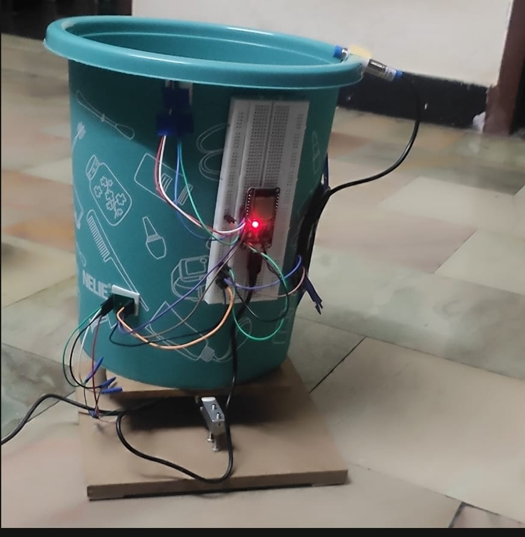
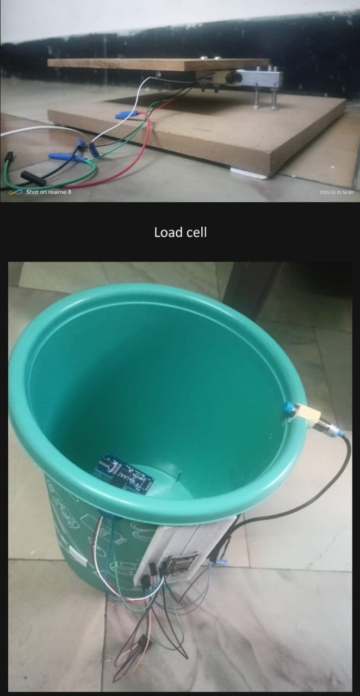

# E-waste-management-system
A smart platform to monitor, collect, and manage e-waste, promoting sustainable recycling and responsible disposal through real-time tracking and analytics.

**Functionalities**

- 🗑️ **Monitor bin levels** – Tracks the fill level of e-waste bins and 🔔 **notifies** when they are full.  
- ⚙️ **Action suggestions** – Recommends whether to ♻️ **dispose** the bin contents or 🛠️ **extract useful metals** based on sensor analysis.  
- ⚖️ **Weight & Metal Detection** – Tracks the weight of e-waste and detects 🪙 **presence of metals** in the bin.  
- 🌍 **Social Awareness** – Displays informative 📢 **posters** and ♻️ **recycling tips** on the homepage to educate users about e-waste.

### 🛠️ Technologies Used

- 🌐 **HTML, CSS, JavaScript** – For creating the web interface and interactive dashboard  
- ⚡ **Node.js** – Backend runtime environment for server-side operations  
- 🍃 **Express.js** – Web framework for building APIs and handling requests  
- 🗄️ **MongoDB** – Database for storing user data and e-waste information  
- 🤖 **Arduino** – For interfacing with sensors to track bin levels, weight, and metal detection

